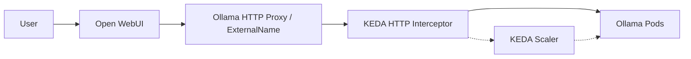

# AI LLM Cluster Configuration

This directory contains the configuration for the AI LLM services, specifically Ollama and Open WebUI, with auto-scaling capabilities provided by KEDA.

## Architecture

The setup uses KEDA (Kubernetes Event-driven Autoscaling) with the HTTP Add-on to scale Ollama pods from zero to one based on incoming traffic from Open WebUI.

## Key Components

### 1. Ollama Scaling ([ollama/ollama-http-scaledobject.yaml](ollama/ollama-http-scaledobject.yaml))
- **Scale-to-Zero**: The `HTTPScaledObject` is configured with `minReplicas: 0` and `maxReplicas: 1`.
- **Host Matching**: The interceptor matches requests based on the `Host` header. It is configured to accept:
    - `ollama-http.ai-llm.svc.cluster.local:8080`
    - `ollama-http:8080`
    - `ollama-http`
- **Responsiveness**: `targetPendingRequests` is set to `1` to trigger scaling immediately on the first request.
- **Stability**: `scaledownPeriod` is set to `300s` (5 minutes) to keep the GPU warm during active sessions.

### 2. KEDA Interceptor Configuration ([keda/http-addon/fleet.yaml](../keda/http-addon/fleet.yaml))
The interceptor timeouts are tuned for LLM workloads:
- `responseHeaderTimeout`: `300s` (Allows for long generation times)
- `tcpConnectTimeout`: `30s`
- `waitTimeout` (replicas): `300s` (Allows time for GPU pod startup and model loading)

### 3. Open WebUI Connection ([open-webui/values-openwebui.yaml](open-webui/values-openwebui.yaml))
- `OLLAMA_BASE_URL`: `http://ollama-http.ai-llm.svc.cluster.local:8080`

## Troubleshooting

### 502 Bad Gateway
If you encounter a 502 error in Open WebUI:
1. **Model Loading**: The first request after a scale-up might take up to 30-60 seconds as the model is loaded into VRAM. The interceptor is configured to wait, but the client (Open WebUI) might still show a timeout.
2. **Ollama Host**: Ensure `OLLAMA_HOST` is set to `0.0.0.0` in `values-ollama.yaml` so the interceptor can reach the pod.
3. **Host Header**: If addressing the service via a new name, ensure it is added to the `hosts` list in the `HTTPScaledObject`.

### Network Problem (Connection Refused)
- Check if the `ollama-http` service (ExternalName) correctly points to `keda-add-ons-http-interceptor-proxy.keda.svc.cluster.local`.
- Verify the interceptor is running in the `keda` namespace.
